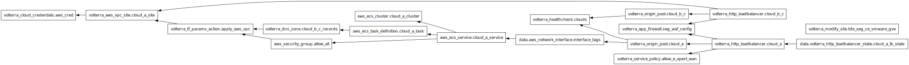

# 2024-seg360-f5xc-demo

 Automation and deployment files for setting up the F5XC demo for SEG360 conference's talk #3 - Automatisation du déploiement et protection d’une application Multicloud <https://www.eventbrite.ch/e/cyberseg-360-tickets-908204312547>

## How to use the demo

First. you should copy the `*.example` files, remove the `.example` extension and adapt the values.

After this, you should be able to run:

```powershell
cd terraform ; .\env.ps1 ; terraform apply
```

This takes easily 20mn to run until the end. Make sure you see the [Troubleshooting](#troubleshooting) section in case of issues.

After this, going to [https://tde-seg.e-xpertsolutions.net/trading/login.php](https://tde-seg.e-xpertsolutions.net/trading/login.php) should show:


You can login with username: `admin` and password `iloveblue`.

After this, you should see the following dashboard:


The parts circled with red triangles basically represent the 3 levels of features available.

1. The main frontend service on AWS is available. You should be able to buy and sell actions, consistently (for example, you should get and error if you try to sell more than what you have, or you should see the figures being updated if you buy or sell).
2. The first backend service on local site with the refer-a-friend feature. You should be able to put any text in this and get a success message. If you enter twice the same you should get an error telling you so.
3. The first backend service on local site with the money-transfer feature. You should be able to consistently transfer money from your accounts to these friends (all white males (ಠ_ಠ) ). You should also be able to do this by clicking on the people faces on the lower bar.

If services 2 and 3 cannot be reached, you will see their emplacement be replaced by "coming soon" message, showing your MCN app is not yet working.

## Architecture

Deployment as of v4 is represented by the following diagram:


The associated Terraform dependencies graph is represented by the following diagram:



## Troubleshooting

- On the on-premise site (Cloud B and Cloud C services), the services should already be launched (See `Distributed Apps > Virtual K8s > seg-workloads`). In case of issues with them, you can re-launch them: in the `Pods` tab, delete the running pods, they will come back freshly created.
- After `terraform apply`, the Cloud A HTTP load balancer will take time to be provisioned and propose a valid ACME challenge. Asterix DNS is very capricious so please, wait until the certificate is provisioned before making any request for `tde-seg.e-xpertsolutions.net`, otherwise it will populate Asterix's cache with bad data and you will have to wait 5mn before it gets invalidated.
